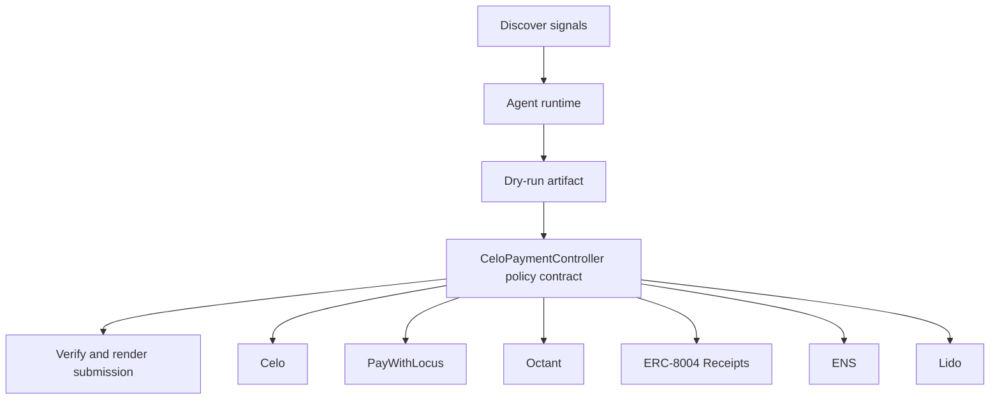

# Celo Commons Payroll

- **Repo:** `Synthesis-Celo-BestAgent`
- **Primary track:** Celo Best Agent on Celo
- **Category:** payments
- **Submission status:** implementation ready, waiting for credentials and TxIDs.

A Celo-focused operator loop that routes stablecoin-native payments and grants after identity and policy checks, ready for live cUSD execution.

## Selected concept

A Celo-focused operator loop routes stablecoin-native payments and grants after identity and policy checks. The guard contract stores recipient approvals, per-cycle caps, and note hashes so live cUSD payments can be attached once real wallets and RPC credentials are provided.

## Idea shortlist

1. cUSD Payroll Swarm
2. Public-Goods Micro-Funder
3. Gasless Yield Trader

## Partners covered

Celo, PayWithLocus, Octant, ERC-8004 Receipts, ENS, Lido, Slice

## Architecture



## Repository layout

- `src/`: shared policy contracts plus the repo-specific wrapper contract.
- `script/`: Foundry deployment entrypoint.
- `agents/`: Python runtime, partner adapters, and project metadata.
- `scripts/`: CLI utilities for running the loop and rendering submissions.
- `docs/`: architecture, credentials, demo script, and security notes.
- `submissions/`: generated `synthesis.md` snippet for this repo.

## Action catalog

| Action | Partner | Purpose | Max USD | Sensitivity |
| --- | --- | --- | --- | --- |
| `celo_payment_settle` | Celo | Use Celo for a bounded action in this repo. | $150 | low |
| `paywithlocus_subaccount_pay` | PayWithLocus | Use PayWithLocus for a bounded action in this repo. | $120 | medium |
| `octant_signal_publish` | Octant | Use Octant for a bounded action in this repo. | $25 | medium |
| `erc_8004_receipts_receipt_anchor` | ERC-8004 Receipts | Use ERC-8004 Receipts for a bounded action in this repo. | $1 | medium |
| `ens_ens_publish` | ENS | Use ENS for a bounded action in this repo. | $5 | low |
| `lido_yield_route` | Lido | Use Lido for a bounded action in this repo. | $200 | medium |
| `slice_checkout_hook` | Slice | Use Slice for a bounded action in this repo. | $35 | medium |

## Commands

```bash
python3 -m unittest discover -s tests
forge test
python3 scripts/run_agent.py
python3 scripts/plan_live_demo.py
python3 scripts/render_submission.py
```

## Credentials

| Partner | Variables | Docs |
| --- | --- | --- |
| Celo | CELO_RPC_URL | https://docs.celo.org/ |
| PayWithLocus | LOCUS_API_KEY, LOCUS_PAYMENT_URL | https://docs.locus.finance/ |
| Octant | OCTANT_SIGNAL_URL | https://octant.app/ |
| ERC-8004 Receipts | RPC_URL | https://eips.ethereum.org/EIPS/eip-8004 |
| ENS | ENS_NAME | https://docs.ens.domains/ |
| Lido | RPC_URL | https://docs.lido.fi/ |
| Slice | SLICE_API_KEY, SLICE_HOOK_URL | https://docs.slice.so/ |

## Live demo plan

1. Copy .env.example to .env and fill the required keys.
2. Deploy the contract with forge script script/Deploy.s.sol --broadcast for CeloPaymentController.
3. Run python3 scripts/run_agent.py to produce a dry run for celo_operator.
4. Set LIVE_MODE=true and rerun python3 scripts/run_agent.py with real credentials.
5. Run python3 scripts/render_submission.py and attach TxIDs plus repo links.
